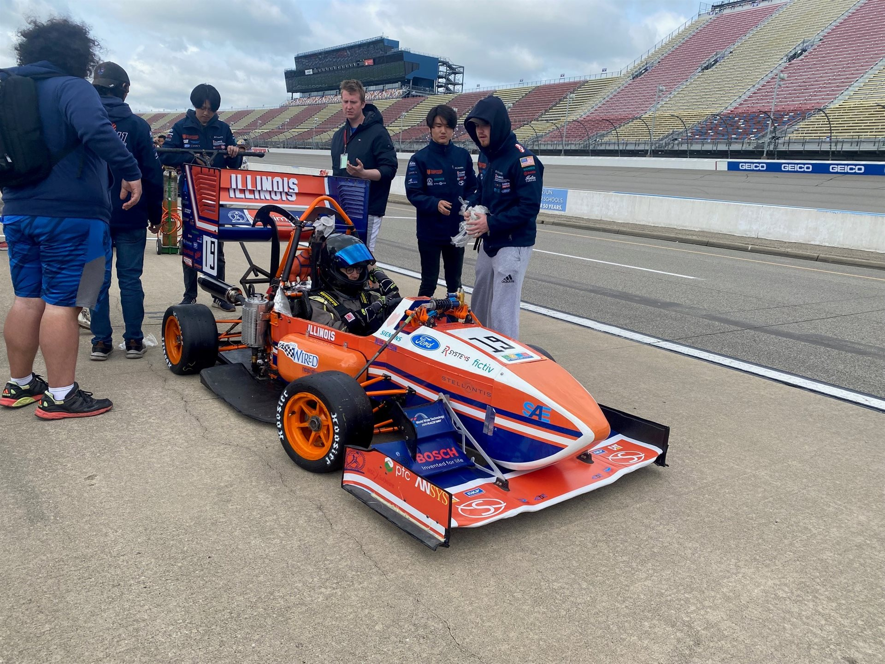

- Developed a torque vectoring control model in **MATLAB/Simulink** to increase cornering performance, helping the team place 7th out of 70 teams in the FSAE EV collegiate competition
- Leveraged **CARSIM** simulation software to validate and fine-tune the torque vectoring algorithm, adjusting yaw moment calculations according to lateral acceleration and yaw rate gain
- Programmed embedded STM32 microcontroller library algorithms to control the car’s state machine, safety features, and interactions with external devices and sensors, while reporting to BMS data dashboard
- Wrote CAN bus test code in **C** to more efficiently troubleshoot the electric car's steering wheel board
  
