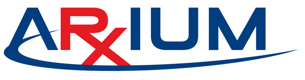

- Contributed to the development of the FastFind Carousel, a project that increased the number of pharmaceutical SKUs by 60% through the use of RxWorks software and the .NET framework
- Developed test cases in C# to test API calls that removed inventory items from the FastFind Carousel
- Enhanced documentation by identifying opportunities to increase user understanding and performance

